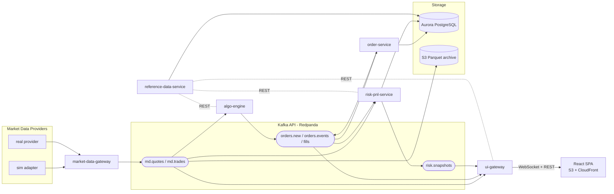

# Jethro — Architecture Overview

Status: design phase. Decisions referenced as ADR-XXXX live in [`docs/adr/`](../adr/README.md).

## System at a glance

Event-driven services (ADR-0003) in Java 21 (ADR-0002) around a Kafka-API backbone —
Redpanda everywhere, at-least-once delivery with idempotent consumers (ADR-0012) — with
a React/TypeScript SPA (ADR-0006) streaming from a UI gateway over WebSocket. Dev runs
the whole stack on one EC2 node; ECS Fargate/Aurora/ALB are the production shape
(ADR-0007 as amended by ADR-0013).



## Services

| Service | Role | Key ADRs |
|---|---|---|
| `market-data-gateway` | Provider adapters (SPI), normalization, conflation | 0009 |
| `algo-engine` | AI-driven strategies: model-inference SPI at decision cadence, deterministic tick path and guardrails, all decisions logged to `ai.decisions` | 0003, 0010 |
| `order-service` | Order lifecycle; simulated execution until a broker is wired | 0003, 0008 |
| `risk-pnl-service` | Positions (projection of fills), PnL, exposures per book | 0005, 0008 |
| `reference-data-service` | Instruments, symbology, book tree | 0008 |
| `ui-gateway` | BFF: REST snapshots + WebSocket streaming, per-view subscriptions | 0006 |
| `finops-service` | Cost telemetry: Cost Explorer polling (tagged infra spend), real-time LLM token pricing from `ai.decisions`, budget alerts | 0011 |

## UI views

Landing page of tiles (`/`), each tile opening a view:

| Tile / route | View | Primary data |
|---|---|---|
| Market Monitor `/market` | live quotes/trades, movers, mini-charts | `md.*` (conflated) |
| Order View `/orders` | order blotter with lifecycle states, fills | `orders.events`, `fills` |
| Book Structure `/books` | book tree → positions → instrument details | reference data + positions |
| Risk & PnL `/risk/:bookId` | per-book PnL (realized/unrealized), exposures, shocks | `risk.snapshots` |
| Costs `/costs` | month-to-date spend by service vs budget, burn rate, live LLM token spend, running-resources panel | `cost.snapshots` (infra ~24h lag; LLM spend live) |

## Data flow invariants

1. External symbology never crosses the market-data gateway (ADR-0009).
2. `fills` is the source of truth for positions; the risk-pnl-service owns the projection
   (ADR-0005, ADR-0008).
3. Events are the only inter-service path for market/trade flow; REST is for reference
   data and snapshots (ADR-0003).
4. Every event carries provider + ingest timestamps; staleness is always measurable.
5. No binary floating point for money — decimals end to end (ADR-0008).
6. Everything runs locally via Docker Compose (Redpanda + Postgres + sim market data)
   with no AWS dependency (ADR-0007).
7. AI never sits on the tick path; risk guardrails are deterministic Java code, and every
   AI decision is recorded as an event on `ai.decisions` — replay/backtests consume the
   recorded decisions, not live re-inference (ADR-0010).
8. Delivery is at-least-once; consumers are idempotent (stable `eventId`, dedupe/upsert,
   duplicate-delivery test per service). Never rely on broker exactly-once (ADR-0012).

## Repository layout (planned)

```
jethro/
├── docs/                  # ADRs, architecture
├── common-domain/         # shared types: Instrument, Book, Position... (ADR-0008)
├── common-messaging/      # Avro schemas + serde for all topics (ADR-0004)
├── services/
│   ├── market-data-gateway/
│   ├── algo-engine/
│   ├── order-service/
│   ├── risk-pnl-service/
│   ├── reference-data-service/
│   ├── ui-gateway/
│   └── finops-service/
├── ui/                    # React + TypeScript SPA (ADR-0006)
├── infra/                 # AWS CDK in Java (ADR-0007)
└── docker-compose.yml     # local topology
```

## Build order (proposed)

1. `common-domain` + `common-messaging` (types and schemas first)
2. `market-data-gateway` with the sim adapter → ticks visible on the bus
3. `ui-gateway` + UI skeleton (landing tiles + Market Monitor) → end-to-end stream on screen
4. `reference-data-service` (instruments, books) + Book Structure view
5. `order-service` (simulated fills) + Order View
6. `risk-pnl-service` + Risk & PnL view
7. `algo-engine` with one toy strategy
8. `infra/` CDK + first AWS deploy: single dev node running the compose stack, tagging,
   AWS Budgets backstop, stop-when-idle schedule (ADR-0013)
9. `finops-service` + Costs view (LLM token pricing can land earlier, with step 7)
