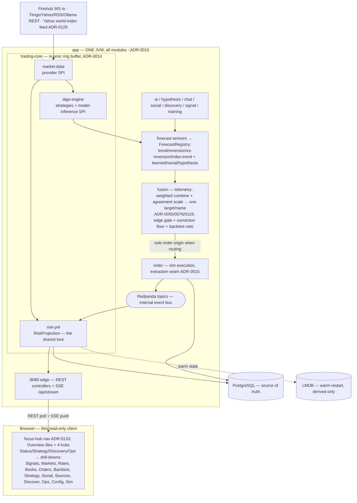

# Jethro — Architecture Overview

**Status: built and running** (single-JVM modular monolith). This document is the *current*
architecture — reconciled against the code on 2026-08-01, not the original design. Decisions live in
[`docs/adr/`](../adr/README.md) (through ADR-0134); the runtime resource/contention picture and the
freeze analysis live in [`system-footprint-analysis.md`](system-footprint-analysis.md); the analytics
north star in [`quant-engine.md`](quant-engine.md).

**Objective (ADR-0132):** the desk exists to **deploy capital to make money**, not preserve the status
quo — grow firm total PnL by putting risk on up to the owner-set **$200k gross budget at moderate
volatility**, inside an unchanged deterministic safety floor (gross/net/instrument caps, firm drawdown
breaker, conviction floor, edge gate, pre-trade guardrail). Exposure under the budget is a resource to
use, not a number to minimise. Nothing runs continuously in production: AWS is dormant by default
(ADR-0013) and the **continuous-improvement loop (ADR-0063)** is the only thing that runs the app —
ephemerally, per ~30-min cycle, scoring PnL/exposure and committing `reports/` to `claude/auto-improve`.

> **Maintenance rule:** when you change a seam (a module boundary, a shared singleton, a transport, a
> lifecycle), update this file in the *same* change. A stale architecture doc is worse than none — it
> misleads the next reader (human or agent) with confidence. This map is only useful if it's true.

## The three transport planes (read this first)

The single most common confusion is stacking three *separate* transports into one. They are distinct:

1. **Browser ↔ backend (UI plane) — pure HTTP.** The UI is a thin, read-only client: ~60 polled
   `/api/*` REST endpoints **plus one SSE stream** (`/api/stream`, `EventSource`) that pushes the
   attention feed. **No websocket, no Redpanda touches the browser.** (ADR-0028; ADR-0017 attention-first.)
   Navigation is **focus-hub** (ADR-0133): a 5-item top nav — Overview + four hubs (Status, Strategy,
   Discovery, Ops) — of tiled landing pages that summarise and link to the drill-down pages; a shared
   `hub.css`/`hub.js` renders the tiles and reads their live headline stats from the same `/api/*` feeds.
2. **Backend ↔ external providers (ingest plane).** Exactly **one websocket** in the whole system —
   the inbound Finnhub trade feed (`wss://ws.finnhub.io`, only on the Finnhub feed). Everything else is
   REST out: Tiingo (history), Yahoo (indicators), RSS (news), Ollama (local LLM), StockTwits/Telegram.
3. **Inside the backend (internal plane) — invisible to the browser.** Hot ticks flow over an
   **in-process ring buffer** (never brokered, ADR-0014). Cross-module events flow over **Redpanda**
   topics (`fills`, `md.marks`, `risk.snapshots`, `ai.decisions`, `orders.*`, `cost.snapshots`) — all
   inside one JVM today, so most are the app messaging itself (see the "do we still need the broker?"
   open question, ADR-0012). Durable state: **Postgres** (system of record) + **LMDB** (warm-restart,
   derived-only).



## Modules (one deployable JVM — ADR-0015)

| Module | Role | Key ADRs | Extraction trigger |
|---|---|---|---|
| `common-domain` | Dependency-free shared types (`Instrument`, `Book`, `Side`, scaled-long `Decimals`) | 0008 | — |
| `common-messaging` | Avro schemas + serde + `Topics` + `Provenance` (feedMode/epoch) | 0012, 0029, 0030 | — |
| `trading-core:{market-data, algo-engine, risk-pnl, runtime}` | Fused market path: feed adapters (provider SPI), algo engine (model-inference SPI), risk/PnL, ring buffer + LMDB + tick archiver | 0009, 0010, 0014 | measured GC interference |
| `modules:order` | Order lifecycle + simulated execution (spread/fee/impact) | 0003, 0025 | **hard: before any real-money broker (ADR-0015)** |
| `modules:reference-data` | Instruments, symbology, book tree, attributes | 0008 | on need |
| `modules:ui-gateway` | REST snapshots + SSE + the static UI pages | 0028 | streaming fan-out load |
| `modules:finops` | **Not built** — empty shell (no Java). Planned: cost telemetry from `ai.decisions` + Cost Explorer | 0011 | on need |
| `app` | Single-JVM assembly + the `:8080` edge + all the subsystems below | 0015 | — |

Isolation is build-enforced (Gradle constraints + ArchUnit): modules depend only on `common-*` and
published interfaces.

## Subsystems in `app` (purpose + what each depends on)

`app` wires ~24 subsystems. Each is an independent lifecycle on its own cadence — see
[`system-footprint-analysis.md`](system-footprint-analysis.md) for the full thread/scheduler inventory
and why so many of them funnelling through `RiskProjection` is the freeze hazard.

| Package | Purpose | Main runtime + cadence | Reads / depends on | ADRs |
|---|---|---|---|---|
| `trading` | The fused market path host: feed adapters (sim/Yahoo/Finnhub), ring buffer, `MarkCache` — the source of marks for everyone | `TradingCoreLifecycle` (tick loop) | provider feeds; publishes `md.marks` | 0009, 0014, 0023, 0024, 0032 |
| `risk` | **The shared risk core.** `RiskProjection` (positions/PnL/exposure — ONE synchronized lock, ~23 callers) + monitors (limit, firm breaker, scenario), VaR, DV01, mark quarantine | `RiskDataConsumer`, `RiskLimitMonitor`, `FirmBreakerMonitor`, `ScenarioMonitor`, `RiskSnapshotPublisher` (~2–5s) | `fills` (source of truth), marks | 0005, 0008, 0020, 0027, 0041 |
| `strategy` | Deterministic momentum/mean-reversion; hourly OOS algo selection; price-derived vol regime; live tuning | `StrategyLifecycle` (5s), `StrategySelector` (60min, heap-guarded) | marks, risk, guardrail, order | 0019, 0043, 0044, 0051, 0052 |
| `hypothesis` | LLM thesis layer: narrative → structured theses → quant sizes/gates; RAG memory; event-keyed dedup | `HypothesisLifecycle` (20s) | Ollama, marks, risk, backtest, narrative feed | 0022, 0035, 0049, 0054 |
| `fusion` | **The decision layer:** every source's forecast → **telemetry-weighted** combine (ADR-0055 ph4), scaled by the sources' **agreement** (ADR-0119/0124) and measured on the weights actually used (effective-DM, ADR-0076) → one target/name → netted delta, vol-target sized off `unit-notional-usd`; sole order origin when routing (sim-gated). Passes the **gate chain**: conviction floor (0059), edge gate (0064, measured expectancy beats measured cost), backtest-support veto (0049) | `FusionLifecycle` (30s) + `ForecastRegistry` + `ForecastCombiner` + `FusionExecutor` | the forecast sensors below + learned/social/hypothesis, marks, risk snapshot | 0055, 0059, 0064, 0076, 0119, 0132 |
| `fusion` (sensors) | Price-derived forecast **sources** pushing into `ForecastRegistry`: EWMAC **trend** (0066), range **reversion** (0070), **cross-sectional** residual reversion (0121), market-**index trend** overlay (0130). Each self-normalises, records every call in telemetry so it earns its own fusion weight, warms from durable history (0071/0131) and advances on prints not cycles (0113) | `TrendForecastLifecycle` (5s), `ReversionForecastLifecycle` (10s), `CrossSectionalReversionLifecycle`, `IndexTrendForecastLifecycle` (15s) | marks, refs, registry, telemetry | 0066, 0070, 0121, 0130 |
| `signal` | Per-signal health telemetry: score each source's live call by realised forward return → the weights fusion combines with | `SignalTelemetryResolver` (60s) | marks; DB `signal_observations` | 0055 |
| `training` | Learned advisory signal: Tiingo training bars → features/labels → purged walk-forward gate | `TrainingBarsLoader`, `LearnedSignalService` | Tiingo, DB | 0053 |
| `social` | Adversarial social pipeline: spam/credibility/corroboration → advisory signals | `SocialLifecycle` (60s) | StockTwits/Telegram/news feeds, refdata | 0050 |
| `discovery` | Universe discovery from RSS/social **+ the dynamic-universe promotion gate**: a daily controller promotes sustained/corroborated/feed-covered candidates into the **reference-data master** (provisional flagged adv/spread, `source=discovered`) — a first-class, tradable instrument — with stalest-eviction at a cap; audited to `universe_promotion` | `DiscoveryLifecycle` (300s), `UniversePromotionLifecycle` (daily) | RSS, refdata (read+write) | 0045, 0050, 0060 |
| `ai` | Local-SLM risk commentary onto the attention feed; Ollama warmup; inference metrics | `RiskCommentatorLifecycle` (60s) | Ollama, risk | 0016 |
| `chat` | Operational chat: SLM parses the question, deterministic code answers, every turn audited | `ChatResponder` (on demand) | Ollama, risk, refdata | 0021 |
| `hedge` | Minimum-variance proxy hedge advisor (equity axis built; DV01/FX deferred) | `HedgeLifecycle` | risk, marks, correlations | 0038–0042 |
| `order` (wiring) | Wires the `order` module — sim execution, the pre-real-broker extraction seam | `OrderConfig` | — | 0015, 0025 |
| `session` | Session calendar + EOD day boundary; session-day supplier for valuation | `EodService` | risk, calendar | 0027 |
| `indicators` | Market-indicator strip + the **world-index feed** (delayed Yahoo indices — SPX et al.), marked as reference data and fed to the index-trend overlay | `IndicatorsService` (300s) | Yahoo (live) / sim | 0023, 0129, 0130 |
| `backtest` | Multi-seed OOS backtest harness (the ADR-0049 hard gate) | `BacktestService` (on demand) | algo engine, sim | 0027, 0043, 0049 |
| `export` | One-click diagnostics `.xlsx` (P&L, positions, fills, TCA, AI outcomes, fusion, telemetry) | `DiagnosticsExportController` | risk, DB, strategy | — |
| `kafka` | The internal event bus impl: publishers + consumers over Redpanda | `KafkaEventPublisher`, consumers | Redpanda | 0012, 0030 |
| `persistence` | Hikari datasource (**pool = 8**) + Flyway migrations | `PersistenceConfig` | Postgres | 0005 |
| `refdata` (wiring) | Wires reference-data | `RefDataConfig` | Postgres | 0008 |
| `ops` | JVM/heap/GC + heap-guard status for the Ops page | `SystemOpsController` | JVM MX beans | — |

## Shared singletons / choke points

- **`RiskProjection`** — one bean, 10 `synchronized` methods, ~23 callers (most lifecycles + every UI
  risk poll). `snapshot()` re-marks all positions *under the lock*, so a slow holder (a GC pause, a
  large book) parks everyone → looks like a whole-server freeze. **This is the leading freeze
  suspect, not the heap alone.** Planned fix: publish an immutable snapshot to a `volatile`; readers go
  lock-free (footprint §7.1).
- **`MarkCache`** (in `trading-core` runtime) — the live mark source, read by strategy, hypothesis,
  fusion, signal, indicators, risk. Concurrent, cheap reads.
- **Hikari pool = 8** shared across ~28 background threads + web threads — a contention risk under load.

## UI pages (focus-hub navigation — ADR-0133, attention-first ADR-0017)

Navigation is grouped **by focus**: a 5-item top nav (Overview + four hubs) replaces the old flat 15-tab
strip. Each hub is a tiled landing page whose tiles show a concise live stat and link to the existing
drill-down pages (content unchanged). A shared `hub.css` + `hub.js` render the tiles and read their
headline stats from the same `/api/*` feeds; a failed fetch leaves the static label, never a misleading
number. Hub tile files are `hub-{status,strategy,discovery,ops}.html`.

| Route | View | Primary data |
|---|---|---|
| `/` (Overview) | **tiles-only landing**: marquee strip + status pills + a single **Consolidated P&L** tile (total/realized/unrealized/gross/net/VaR) + the four focus tiles + a **positions-by-market** table | risk, `/api/fusion/targets`, `/api/improve/status` |
| `/hub-status.html` (Status) | the firm **cockpit** (was the old landing): attention feed + combined-signals view + hedging + P&L + today's orders + by-market, with Books/Orders/Markets/Rates quick-tiles | `ui.attention`, `/api/fusion/targets`, risk |
| `/hub-strategy.html` (Strategy) | tiles → Strategy, Signals, (Basket — planned), Discovery | strategy, fusion |
| `/hub-discovery.html` (Discovery) | tiles → Discovery, Sources, Social | discovery, social, feeds |
| `/hub-ops.html` (Ops) | tiles → Improve (loop cycles), Config, Sim, Backtest, Models | improve, ops |
| `/signals.html` | **AI/strategy drill-down**: fused target book + AI hypotheses + strategy actions | fusion, hypotheses, strategy |
| `/markets.html` `/rates.html` | live marks/movers; swap book + curve DV01 | `md.marks`, rates |
| `/books.html` `/orders.html` | book tree → positions; order blotter + fills | refdata, positions, `fills` |
| `/backtest.html` `/strategy.html` | OOS selection; strategy signals/tuning/regime | backtest, strategy |
| `/social.html` `/social-sources.html` `/discovery.html` | social signals, source health, universe discovery | social, discovery |
| `/improve.html` | continuous-improvement loop heartbeat — per-cycle scored PnL + decision (ADR-0063) | `/api/improve/status` |
| `/ollama.html` (Models) | LLM load, JVM/heap guard, RAG, training, learned-signal gate, signal health, fusion book | ops, training, signal, fusion |
| `/config.html` `/sim.html` | config; sim control panel (ADR-0031) | config, sim |

## Data flow invariants (violations are bugs)

1. External symbology never crosses the `market-data` boundary; internal code keys on `instrumentId` (0009).
2. `fills` is the source of truth for positions; only `risk-pnl` writes the projection (0005/0008).
3. Hot ticks flow over the in-process ring buffer; cross-module flow is a Redpanda event even in-process,
   so extraction stays mechanical (0014). (One JVM today — most events are intra-process.)
4. Every event carries provider + ingest timestamps; marks restored from LMDB are flagged stale (0014).
5. No binary floating point for money — `BigDecimal`/Avro decimal/`NUMERIC` at boundaries, scaled-long
   fixed-point in the hot path (invariant 1).
6. Everything runs locally via Docker Compose (Redpanda + Postgres + sim feed), no AWS dependency (0013).
7. AI never sits on the tick path; risk guardrails are deterministic code; every AI decision is an event
   on `ai.decisions` embedding its context snapshot (0010/0016). No model number reaches PnL/risk.
8. Delivery is at-least-once; consumers are idempotent (stable `eventId`, duplicate-delivery test) (0012).
9. LMDB holds derived data only — losing it costs restart time, never data (0014). Dropped ticks/marks
   are counted and exposed, never silent.
10. Sim/live/replay never aggregate across modes: every event carries `feedMode` + `sessionEpoch`; a
    sim↔live switch rolls a new epoch/namespace (0029). Serde resolves the writer schema (0030).
11. **Signals stop placing orders (ADR-0055):** when fusion routing is on (sim-only), the fusion layer
    is the *sole* order origin — strategy auto-exec and hypothesis autonomy stand down; orders are the
    netted delta between the combined target and the current book, through the ADR-0049 gate chain.
12. **Sim isolation (ADR-0060 / invariant 9 in CLAUDE.md):** the tradable universe is the reference-data
    master, never the legacy `sim-instruments` list. A discovery-promoted name is written to refdata and
    is thereby first-class everywhere — marks, indicators, signals, OOS backtest, and the order path —
    trading through the same gates as any name (no monitor-only special-casing). The sim only *consumes*
    that universe when testing; it never defines it.

## Repository layout (actual)

```
jethro/
├── docs/{adr, architecture}         # decisions + this map + footprint analysis
├── common-domain/                   # dependency-free shared types (ADR-0008)
├── common-messaging/                # Avro schemas + serde + Topics + Provenance (0012/0029/0030)
├── trading-core/{market-data, algo-engine, risk-pnl, runtime}   # fused market path (ADR-0014)
├── modules/{order, reference-data, ui-gateway, finops(shell)}
├── app/                             # single-JVM assembly + ~24 subsystems + :8080 edge (ADR-0015)
├── infra/  infra/packer/            # AWS CDK + AMI bake (ADR-0007/0013)
├── deploy/                          # compose rollout alternatives
└── docker-compose.yml               # local topology
```

## What is NOT built / partial

`finops` (empty shell, ADR-0011) · the S3 Parquet tick archiver (ADR-0014) · the external frontier AI
tier (ADR-0010, behind cost triggers) · hedge DV01/FX axes + AUTO submission (ADR-0038/0039) · the
runtime feed-switch endpoint (ADR-0029, restart-to-switch today) · `daily_closes`/`mark_quarantine`
feed-mode scoping (ADR-0029) · ADR-0060 mid-session hot-subscribe (a promoted name joins the trading
universe at the next session, since feed symbol maps + the sim/OOS universe are read at boot) and the
measured-ADV replacement of the provisional adv/spread a discovered name trades on until it has its own
tape · **per-name/region beta for the index-trend overlay** (ADR-0130 applies unit market beta today) ·
the **Basket** tile on the Strategy hub (ADR-0133, planned — no page yet). Real-money brokerage is still
gated behind the `order`-module extraction (ADR-0015). See [`deferred-register.md`](../deferred-register.md)
and the ADR index Implementation column for the full list.
