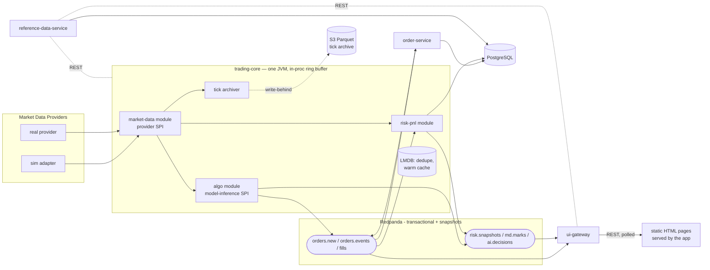

# Jethro — Architecture Overview

Status: design phase. Decisions referenced as ADR-XXXX live in [`docs/adr/`](../adr/README.md).
The risk/pricing analytics layer has its own target architecture (north star):
[`quant-engine.md`](quant-engine.md).

## System at a glance

The market path is **one process** — `trading-core` (ADR-0014): feed adapters, the
AI-driven algo engine, and risk/PnL communicate over an in-process ring buffer;
microseconds from tick to decision. The **durable log** (Kafka API via Redpanda,
ADR-0012) carries only transactional flow and snapshots: orders, fills, AI decisions,
conflated marks and risk snapshots — at-least-once, idempotent consumers. Ticks are
archived write-behind to S3 Parquet; backtests replay the archive through the same
pipeline via the feed SPI (ADR-0009). UI is server-served static pages polling
`ui-gateway` REST (ADR-0028; React/streaming deferred behind concrete triggers). **All modules currently assemble into a single JVM
(`app`, ADR-0015)** — the diagram below shows logical module boundaries; every arrow
touching the log is a real Redpanda topic even in-process, so extraction later is
mechanical. Dev runs the whole stack (app + Redpanda + Postgres) on one EC2 node; ECS
Fargate/Aurora/ALB are the production shape (ADR-0007/0013).



## Modules (one deployable JVM — ADR-0015)

| Module | Role | Key ADRs | Extraction trigger |
|---|---|---|---|
| `trading-core` cluster (market-data, algo-engine, risk-pnl, runtime) | Fused market path: feed adapters (provider SPI), AI algo engine (model-inference SPI), risk/PnL over the ring buffer; tick archiver; LMDB local state | 0009, 0010, 0014 | measured GC interference |
| `order` | Order lifecycle; simulated execution until a broker is wired | 0003, 0008, 0012 | **hard: before any real-money broker connection** |
| `reference-data` | Instruments, symbology, book tree | 0008 | on need |
| `ui-gateway` | BFF: REST snapshots + the static UI pages (polled; streaming deferred with ADR-0028) | 0006, 0028 | streaming fan-out load |
| `finops` | PLANNED, not built (empty shell): cost telemetry — Cost Explorer polling, LLM token pricing from `ai.decisions`, budget alerts | 0011 | on need |

Module isolation is build-enforced (Gradle constraints + ArchUnit): modules depend only
on `common-domain`, `common-messaging`, and published interfaces — never internals.

## UI views (attention-first — ADR-0017)

Landing page (`/`) is the **attention feed**: ranked cards from deterministic triggers
(always surface) annotated/grouped by agents (never suppress). Every card links to its
evidence. Detail views are drill-down behind the feed, each with a "show everything"
mode:

| Route | Drill-down view | Primary data |
|---|---|---|
| `/` | attention feed: alerts, anomalies, AI commentary, "all quiet" digests | `ui.attention`, `ai.decisions` |
| `/market` | live marks, movers, mini-charts | `md.marks` (1Hz conflated) |
| `/orders` | order blotter with lifecycle states, fills | `orders.events`, `fills` |
| `/books` | book tree → positions → instrument details | reference data + positions |
| `/risk/:bookId` | per-book PnL (realized/unrealized), exposures, shocks | `risk.snapshots` |
| `/costs` | spend by service vs budget, burn rate, live LLM token spend, running resources | `cost.snapshots` (infra ~24h lag; LLM spend live) |

## Data flow invariants

1. External symbology never crosses the market-data module boundary (ADR-0009); enforced
   in review now that it is a module, not a process (ADR-0014).
2. `fills` is the source of truth for positions; the risk-pnl module owns the projection
   (ADR-0005, ADR-0008).
3. Events are the only **inter-process** data path; inside `trading-core` the ring buffer
   rules (ADR-0014). Anything crossing a process boundary is an event on the log.
4. Every event carries provider + ingest timestamps; staleness is always measurable.
   Marks restored from LMDB are flagged stale until the feed refreshes them.
5. No binary floating point for money — exact decimal semantics end to end (ADR-0008):
   `BigDecimal`/Avro decimal/`NUMERIC` at boundaries, scaled-long decimal fixed-point in
   the allocation-free hot path (declared scale per field).
6. Everything runs locally via Docker Compose (Redpanda + Postgres + sim market data)
   with no AWS dependency (ADR-0007/0013).
7. AI never sits on the tick path; risk guardrails are deterministic Java code; every AI
   decision is an event on `ai.decisions` **embedding the market-context snapshot it
   decided on** — replay/backtests consume recorded decisions (ADR-0010, 0014).
8. Delivery is at-least-once; consumers are idempotent (stable `eventId`, dedupe/upsert,
   duplicate-delivery test per service). Never rely on broker exactly-once (ADR-0012).
9. Embedded local state (LMDB) holds **derived data only** — losing it may cost restart
   time, never data (ADR-0014). Ticks/marks are droppable under pressure, but drops and
   archive gaps are always counted and exposed as metrics — never silent.

## Repository layout (planned)

```
jethro/
├── docs/                    # ADRs, architecture
├── common-domain/           # shared types: Instrument, Book, Position... (ADR-0008)
├── common-messaging/        # Avro schemas + serde for all topics (ADR-0012)
├── trading-core/            # fused market path module cluster (ADR-0014)
│   ├── market-data/         #   provider SPI + adapters (sim first)
│   ├── algo-engine/         #   strategies + model-inference SPI (ADR-0010)
│   ├── risk-pnl/            #   positions, PnL, exposures
│   └── runtime/             #   ring buffer, LMDB state, tick archiver, wiring
├── modules/
│   ├── order/
│   ├── reference-data/
│   ├── ui-gateway/
│   └── finops/
├── app/                     # single-JVM assembly of all modules (ADR-0015)
├── deploy/                  # single-node EC2 deploy: prod compose, Caddy, SSM rollout + quickstart (ADR-0013)
├── infra/                   # AWS provisioning (ADR-0007/0013): CDK dev-node stack + Packer baked-AMI path
│   └── packer/              # bake the full stack into an x86 AMI; GitHub 'Bake AMI' spawns the instance
└── docker-compose.yml       # local topology
```

## Build order (proposed)

1. `common-domain` + `common-messaging` (types and schemas first, incl. `eventId` base
   and the `ai.decisions` context-snapshot field) + `app` shell with ArchUnit boundary
   rules (ADR-0015)
2. `trading-core` skeleton in the app: ring buffer + sim adapter behind the feed SPI →
   ticks flowing in-process; LMDB dedupe/warm-cache wiring
3. model-inference SPI (`algo-engine`) + Ollama adapter (local SLM) + risk commentator
   agent emitting `AiDecision` events (ADR-0016) — AI in the loop before pixels
4. `ui-gateway` module + UI skeleton (landing tiles + Market Monitor with AI
   commentary panel) fed by `md.marks`; AiDecision events move onto the broker here
5. `reference-data` module (instruments, books) + Book Structure view
6. `order` module (simulated fills) + Order View
7. `risk-pnl` module + `risk.snapshots` + Risk & PnL view; scenario-proposer agent
8. `algo-engine` toy strategy + frontier-API adapter (ADR-0010); tick archiver +
   replay adapter (backtest loop closes here)
9. `infra/` CDK + first AWS deploy: single dev node running the compose stack, tagging,
   AWS Budgets backstop, stop-when-idle schedule (ADR-0013)
10. `finops` module + Costs view (LLM token pricing can land earlier, with step 8)
