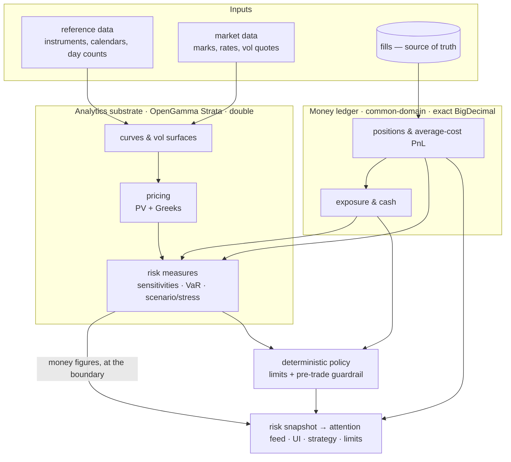

# Jethro — Multi-Asset Quant Engine (target architecture)

Status: north star for the risk/pricing engine. Decisions live in [`docs/adr/`](../adr/README.md);
this sits under [`overview.md`](overview.md) and elaborates the `risk-pnl` + `algo-engine`
analytics layer. Foundation: **OpenGamma Strata** as the analytics substrate (ADR-0020).

## How to use this doc

This is the anti-tunnel-vision anchor. Every non-trivial risk/pricing change must name the
**layer** and **asset class** it serves here, and what it defers. If a task doesn't map to
a box below, it's either mis-scoped or missing from the plan — stop and reconcile before
building. "It computes the number we need right now" is not a location on this map.

## The layered model

The engine is layered so each asset class plugs into the *same* pipeline; only the market
data and product mapping differ. The **exact money ledger** runs alongside as the record of
truth — analytics never overwrite it.

## The money/analytics boundary (invariant 1)

The single rule that keeps this from becoming a toy *or* violating exactness:

- **Exact `BigDecimal` (record of truth):** positions, average-cost PnL, realized cash,
  quantities, notional exposure. Owned by `common-domain` / `risk-pnl`. Never `double`.
- **`double` analytics (estimates):** curves, discount factors, implied vols, Greeks, VaR,
  scenario P&L. Owned by Strata. These are *estimates*, not ledger money.
- **Conversion happens only at the money boundary:** a measure that becomes a currency
  figure (VaR in USD, scenario P&L, option PV booked to the ledger) crosses back to
  `BigDecimal` at a single, reviewed conversion point — never mingled mid-calculation.

## Asset-class coverage matrix

The pipeline is one shape; asset classes differ in what market data and pricing they need.
Priority reflects the current book and the build order (overview step 7→8).

| Asset class | Market data needed | Strata product / pricer | Risk beyond notional | Priority |
|---|---|---|---|---|
| Equity (cash) | last mark | (mark × qty; no curve) | vol, VaR, concentration | **now** |
| Index/commodity futures | last mark, multiplier | future price × multiplier | vol, VaR, basis (later) | **now** |
| FX spot | pair mark | FX rate; cross via triangulation | vol, VaR, **ccy conversion** | next |
| Rates (bond/IRS futures & cash) | yield/discount curve | curve pricer → PV, DV01 | curve sensitivities, VaR | after FX |
| Options (listed) | vol surface + underlier | Black/curve pricer → PV, Greeks | delta/gamma/vega, scenario | after rates |
| Credit | credit curve | CDS pricer → PV, CS01 | spread sensitivities | later |

FX is the pivotal one: it unlocks **cross-currency** so the risk rollups stop reporting
`MIXED` and sum in a base currency (today all instruments are USD to defer this).

## What we own vs what Strata owns vs QuantLib

- **We own:** the domain ledger (positions/PnL/cash, exact), the event flow (fills →
  projection, `risk.snapshots`), deterministic **policy** (limits + pre-trade guardrail,
  invariant 7), and the attention/UI surface. These never move into a library.
- **Strata owns:** market-data calibration (curves, surfaces), pricing (PV, Greeks),
  and the measures + scenario/stress framework. The analytics layer only.
- **QuantLib:** reserved as an **out-of-process** pricing service (ADR-0002/0010) for
  exotics Strata can't cover — never JNI-embedded on the Pi.

## Current state vs target (honest gap)

Built (overview steps 1–8 partial):
- exact positions + average-cost realized PnL (`Positions`), mark-to-market unrealized,
  **notional** gross/net exposure, per-book/asset-class/firm rollups (`RiskProjection`);
- deterministic **limits + pre-trade guardrail** (`RiskLimitEvaluator`, `PreTradeGuardrail`),
  including loss gates, instrument concentration, firm caps and in-flight reservations;
- the Strata substrate (sequencing steps 1/3/4): **FX cross-currency** rollups via
  `FxMatrix` (`FxConversion`), a calibrated **USD SOFR zero curve** from live sim quotes
  (`CurveService`), and **swap PV / par / DV01** via the discounting pricers
  (`SwapPricingService`) — analytics in `double`, money at the boundary (invariant 1);
- **rates & swaps as market participants** (layer: market data + strategy; asset class:
  rates): Treasury futures priced *from* the factor curve (duration link + small basis),
  the curve coupled to the sim's market regimes (trends/vol/shocks), and swap par rates
  quoted live (`USD_IRS_*`) and tradeable under the V9 quoting convention — price = par
  rate %, 1 lot = $1M, multiplier = inception DV01×100. Named limitation: constant-DV01
  first-order PnL; exact revaluation stays with the Strata pricer;
- a deterministic momentum **strategy** — z-score (vol-adaptive) signals, vol-scaled
  sizing, position-aware participation, per-class routing/caps → guardrailed
  suggestions/auto-exec (ADR-0018/0019);
- an interim parametric **VaR/vol/concentration** stat helper (`RiskStats`) — a stopgap
  Strata's measures framework subsumes;
- **scenario/stress, full revaluation on the rates legs** (layer: risk measures):
  `ScenarioEngine` revalues live positions under the standard shocks (rates ±100bp,
  equities −5%, USD +2%, combined risk-off), per book and firm, exact-decimal; surfaced
  on the Overview stress panel (`/api/scenarios`) and as a deterministic attention
  trigger when the worst stress exceeds the firm loss cap (`ScenarioMonitor`). Rates
  legs are FULL revaluation on the shifted curve: bond futures re-price the CTD par
  bond at the shocked yield (convexity — ±100bp on ZB moves ~7 points off linear), and
  swaps re-price the trade-dated book's seasoned trades (aging + convexity, past
  fixings pinned to the base curve), with stated first-order fallbacks when curves
  aren't live. Note: implemented as direct shifted-curve repricing through the same
  Strata pricers rather than the `ScenarioMarketData` scenario-set wrapper — identical
  math at one-scenario-at-a-time scale; adopt the wrapper if scenario sets grow.
  Named limitation: no equity×FX cross-terms (first-order translation, documented).

- shipped since this gap list was first written (kept here so the doc stays honest):
  **portfolio VaR** — historical (`VarMath`) AND parametric with an EWMA covariance
  matrix + per-position correlation-to-portfolio (`CovMath`, `/api/var`), feeding
  covariance-aware sizing; the **trade-dated swap book** (`swap_trades`, seasoned Strata
  revaluation with roll-down, live DV01 refresh, `/api/swaps/book`); and **key-rate
  DV01 as risk state** — per-book bucketed sensitivities on the CURVE NODES
  (`SwapPricingService.bucketedDv01Seasoned` + CTD key-rate splits for Treasury futures,
  `Dv01Service`, `/api/dv01`), superseding the static key-tenor `RatesRiskService`.

Not built (the gap this doc frames):
- Strata **measure-based VaR** (the measures framework subsuming the parametric/
  historical stopgaps) — the last piece of sequencing step 2;
- Greeks/options, credit (CS01) — no options or credit products exist yet;
- regime-aware strategy behaviour beyond the volatile-regime sizing scale
  (step 5 remainder).

## Sequencing (every future task has a home here)

1. **Adopt the substrate.** Verify the Strata artifact resolves; introduce a `pricing`
   seam in `risk-pnl` (or a sibling module) that maps `Instrument` → Strata product and
   `Mark`/curve data → Strata market data. Equities/futures first (mark-based, trivial map).
2. **Measures over the substrate.** Replace the `RiskStats` stopgap with Strata measures:
   volatility, VaR, sensitivities, and a first **scenario/stress** (parallel shocks) — the
   real tail-risk answer parametric VaR only approximates.
3. **FX + cross-currency.** FX products + triangulation; risk rollups sum in a base
   currency; retire the `MIXED` fallback.
4. **Rates, then options, then credit.** Curves → DV01/curve sensitivities; vol surfaces →
   Greeks; credit curves → CS01. Each is "new market data + product map," not a new pipeline.
5. **Close the loop.** Feed the enriched snapshot into the strategy and into limits (VaR
   cap, concentration cap); scenario results become attention triggers.

Each step reaffirms the invariants: exact money ledger (5), AI/strategy never computes the
risk numbers (7), guardrails deterministic (7), drops/gaps counted not silent (9).
